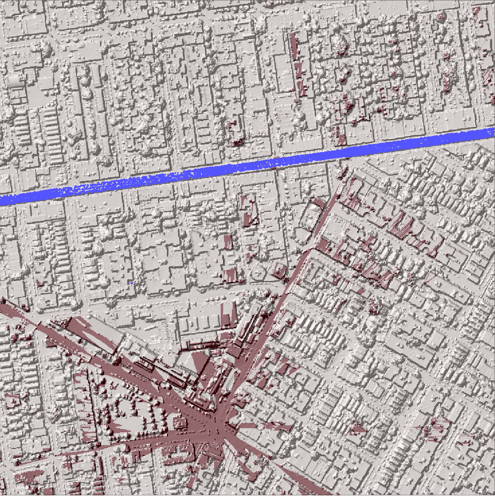
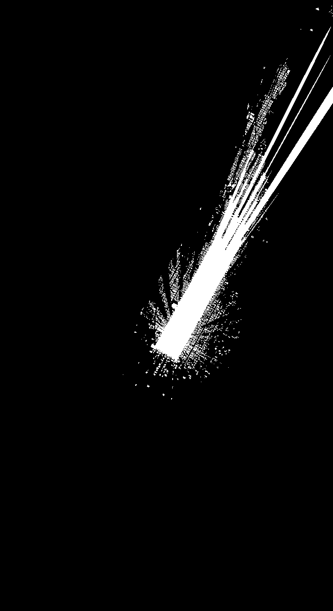

2024-06-24
- [Converted viewshed raster to polygon geodataframe](https://py.geocompx.org/05-raster-vector#sec-raster-to-polygons) using rasterio, pandas, shapely

2024-06-23
- Next Steps:
  - Work to detect intersection between viewshed and planimetric buffer
  - Automate dataset builds
  - Consider sources of inaccuracy - outdated buildings, railroad features that aren't actually visible (see Hudson Yards), etc.
- Update: planimetric database - railroad features with a 10' buffer appear to align pretty closely with the bridge deck returns from the 2017 point cloud -> seems like a viable solution
- [gdal_fillnodata](https://gdal.org/programs/gdal_fillnodata.html) works well, but leaves some artifacts from the original point cloud - typically small clusters of pixels cells with significantly higher z-values that their surroundings
- Running gdal_viewshed on DSM derived from point cloud also appears to generally work:
  
  Where blue dots are point cloud returns classified as bridge (elevated 7 train in this image), undelying image is LAZ-derived hillshade, and red tones are visible areas from a 100ft observer z-value in the center of the intersection
2024-06-22
- Next Steps:
  1. use gdal to fill no data sections of new DSM
  2. test viewshed on Jackson Heights DSM from pdal pipeline
- Realizing that the viewshed as I've been running it won't work alone, because creating a viewshed requires defining the target elevation, but the target in this case is a series of continuous x/y/z coordinates without a static height to input into the viewshed command
- Ideas: 
  1. use a line of sight algorithm like [Bresenham's Line Algorithm](https://en.wikipedia.org/wiki/Bresenham%27s_line_algorithm) or [Albert Ford's symmetric shadow casting](https://www.albertford.com/shadowcasting/) (though both would requires accounting for third dimension)
  2. use a first return digital surface model (DSM) instead of the DEM with building heights. This would include features such as elevated rail structures, and could be used to run the viewshed directly
- For the DSM idea, the [Open Data links](https://data.cityofnewyork.us/City-Government/Topobathymetric-LiDAR-Data-2017-/7sc8-jtbz/about_data) for the NYC DSM are broken, but it looks like I can use pdal to generate a DSM. 
  - Note that converting to LAZ significantly reduces size and point cloud >> TIFF processing time
  - Resources:
    - [pdal: Generating a DTM](https://pdal.io/en/2.6.0/workshop/generation/dtm/dtm.html)
    - [LiDAR Data Source](https://orthos.dhses.ny.gov/?Extent=-9603624.133747088,4774299.7366908705,-7659066.134172721,5795498.434580554&Layers=07_meter_dem_index_usgs,1_meter_dem_index_fema,1_meter_dem_index_usgs,1_meter_dem_index_tidal_water,1_meter_dem_index_hydro_flattened,1_meter_dem_index_usda_utm18n,1_meter_dem_index_usda_utm17n,1_meter_dem_index_nys,2_meter_dem_index_ne_lidar,2_meter_dem_index_nys,2_meter_dem_index_fema,2_meter_dem_index_monroe_county,2_meter_dem_index_tompkins_county,2_meter_dem_index_erie_county&layerGroups=DEMIndexes,Orthoimagery&rightMenu=0#)
    - [Blog post detailing using pdal to generate a _DSM_ specifically](https://www.simonplanzer.com/articles/lidar-chm/) with my [resulting pipeline JSON here](dsm_test.json)
  - This route feels promising! Thoughts:
    - Time consuming to build. Might be possible to iterate through NYC one LAS tile at a time to save disk space - for each, download, compress, create DSM, delete LAS/LAZ
    - Since the LiDAR data is from 2017, it would likely be necessary to take the building footprint raster and burn in corrected heights where necessary onto the DSM

2024-06-21
- update:
  - Able to use subprocess.call() to call gdal
  - Might be some weirdnes with the output files, but they look cool!
  
  (done with observer z and target z each set to 200ft I think)
- able to:
  - successfully export a sealevel-normalized bldg height raster
  - run gdal_viewshed in terminal, and output what seems like a legit viewshed
- struggling to:
  - translate the gdal call into python via either (1) gdal.ViewshedGenerate() or (2) subprocess.call()
- Next steps:
  - plan how to best run the gdal call from within a pipeline. Maybe it doesn't need to be run from python? Could string everything together via bash or other

2024-06-04
- wrote code through bldg footprint raster generation
- may need to (1) normalize building height pixels to actual building heights and (2) figure out if the background of the raster is going to be an issue since it seems to be a similar color to the tallest buildings

2024-06-03
- was able to load bldg footprints to geoparquet, and had initial success with converting vector to raster
- need to resolve:
  - potential crs issue with output GTIFF
  - are raster values correct in output GTIFF
### Resources:
- [geo1015](https://3d.bk.tudelft.nl/courses/backup/geo1015/2020/les/)
  - [associated book](https://github.com/tudelft3d/terrainbook/releases)
- [GDAL viewshed](https://gdal.org/programs/gdal_viewshed.html)
- [Line of Sight Analysis in Python](https://spatial-dev.guru/2023/12/10/line-of-sight-analysis-in-digital-elevation-models-using-python/)
- [Rasterize Vectors w. Rasterio](https://pygis.io/docs/e_raster_rasterize.html)
- [Install GDAL](https://mits003.github.io/studio_null/2021/07/install-gdal-on-macos/)
- Data
  - [NYBB](https://data.cityofnewyork.us/City-Government/Borough-Boundaries/tqmj-j8zm)
  - [Land Cover 2010]()
  - [Building Footprints]()

